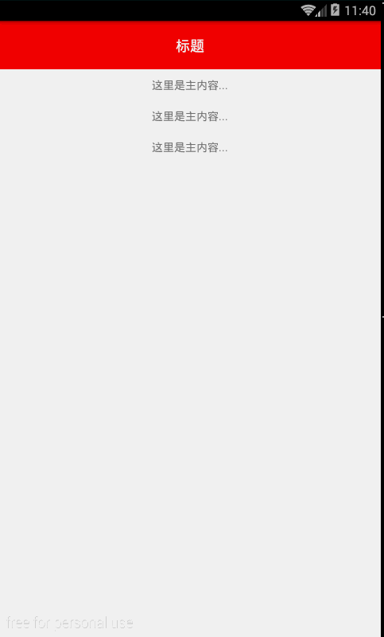

#discription
Android 自定义的简单的侧滑菜单 ! 

#usage

xml : 
```

<com.gyw.slidingmenu.SlidingMenu
        android:layout_width="match_parent"
        android:layout_height="match_parent"
        >

        <!-- 左侧菜单布局 -->
        <include layout="@layout/view_left_menu"></include>

        <!-- 主界面布局 -->
        <include layout="@layout/view_content_main"></include>

</com.gyw.slidingmenu.SlidingMenu>
	
```


#Screenshot



#Record

###2016/10/10
处理测量,布局,滑动的逻辑;

###2016/10/11
处理事件分发的逻辑;

